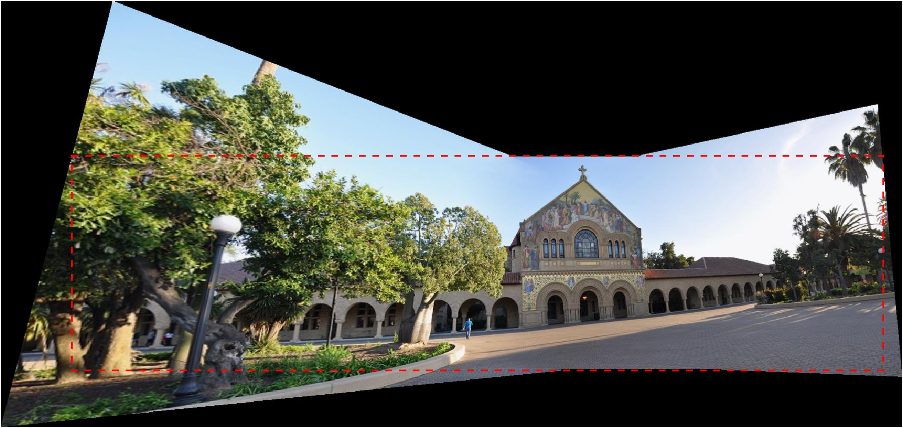
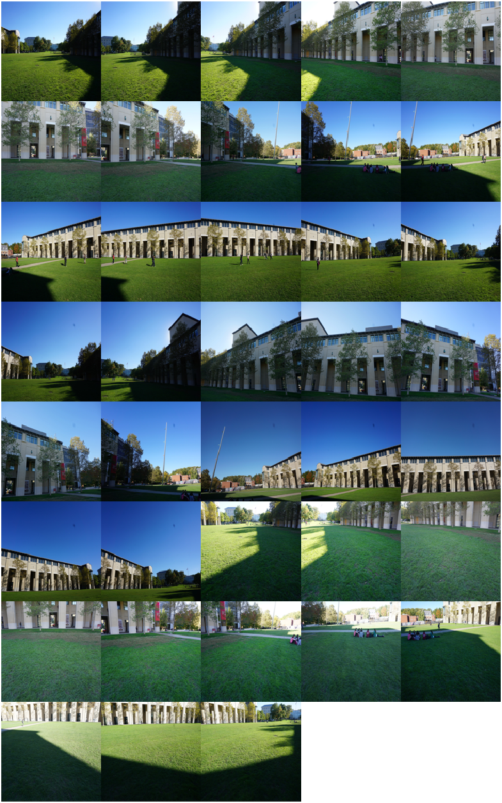
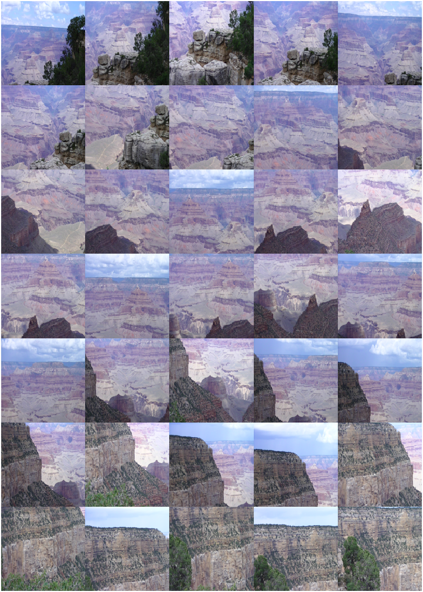
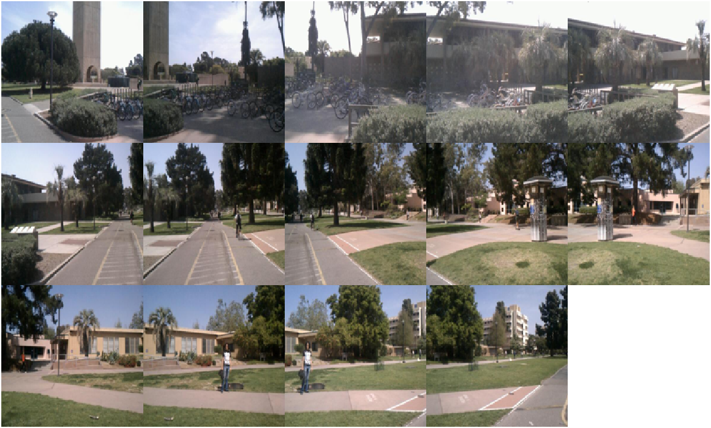
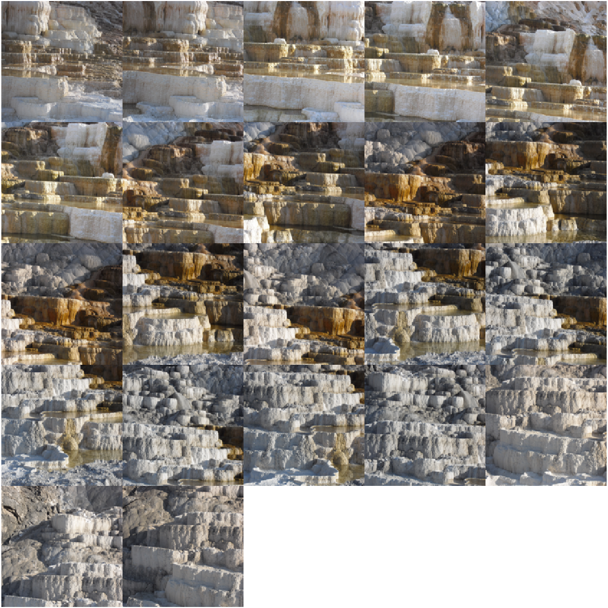
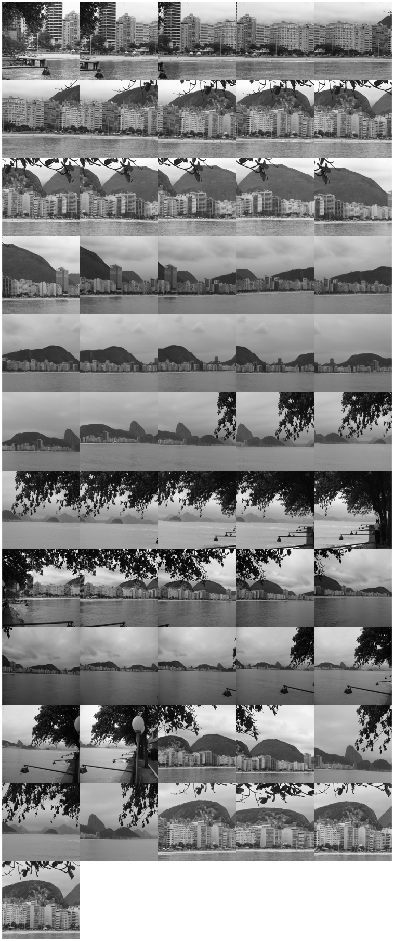

# AutoPanoStitch
[](https://www.mathworks.com/matlabcentral/fileexchange/105850-automatic-panorama-stitcher-autopanostitch) [](https://matlab.mathworks.com/open/github/v1?repo=preethamam/AutomaticPanoramicImageStitching-AutoPanoStitch)

Automatic Panorama Stitching software in MATLAB. Spherical, cyclindrical and planar projections stitching is supported in this version and can recognize multiple panoramas.

# Stitched images 1:
| Type | Images |
| --- | --- |
| Stitched image |  |
| Crop box |  |
| Cropped image |  |

# Stitched images 2:
| Type | Images |
| --- | --- |
| Stitched image |  |
| Cropped image |  |

# Requirements
MATLAB <br />
MATLAB Computer Vision Toolbox <br />
MATLAB Image Processing Toolbox <br />
MATLAB Parallel Computing Toolbox <br />
MATLAB Optimization Toolbox

# Run command
Please use the `Main_AutoPanoStitch.m` to run the program. Change the `folderPath      = '../../../Data/Generic';` to your desired folder path. Also, change the `folderName      = '';` to a valid name. You can download the whole Generic folder datasets in [AutoPanoStitch Stitching Datasets Compilation](https://1drv.ms/f/s!AlFYM4jwmzqrtaBpxVMpJegvN9QVZw?e=UIaYug).

Change the hyper parameters accordingly if needed. But it is not required though.
```
%% Inputs 2
%--------------------------------------------------------------------------
% Parallel workers
input.numCores = 4;            % Number of cores for parallel processing

%% Inputs 3
% Warping
input.warpType = 'cylindrical';   % 'spherical' | 'cylindrical' | 'planar' (projective)

% Focal length
input.fx = 1600;       % focal length of camera in pixels
input.fy = 1600;       % focal length of camera in pixels

% Distortion coefficients [k1, k2, k3, p1, p2]
input.DC = [0, 0, 0, 0, 0];

% Feature matching
input.detector = 'SIFT';                % 'HARRIS' | 'SIFT' | 'FAST' | 'SURF' | 'BRISK' | 'ORB' | 'KAZE'
input.Matchingmethod = 'Approximate';   %'Exhaustive' (default) | 'Approximate'
input.Matchingthreshold = 1.5;  %       10.0 or 1.0 (default) | percent value in the range (0, 100] | depends on binary and non-binary features
input.Ratiothreshold = 0.6;             % ratio in the range (0,1]
input.NumLayersInOctave = 3;            % Number of layers in each octave -- SIFT only
input.ContrastThreshold = 0.00133;      % Contrast threshold for selecting the strongest features, 
                                        % specified as a non-negative scalar in the range [0,1]. 
                                        % The threshold is used to filter out weak features in 
                                        % low-contrast regions of the image. -- SIFT only
input.EdgeThreshold = 6;                % Edge threshold, specified as a non-negative scalar greater than or equal to 1. 
                                        % The threshold is used to filter out unstable edge-like features  -- SIFT only  

% Image matching (RANSAC)
input.Inliersconfidence = 99.9;         % Inlier confidence [0,100]
input.maxIter = 2000;                   % RANSAC maximum iterations
input.Transformationtype = 'affine'; % 'rigid' | 'similarity' | 'affine' | 'projective'
input.MaxDistance = 1.50;               % Maximum distance (pixels) 1.5

% Image blending and panorama
input.sigmaN = 10;                  % Standard deviations of the normalised intensity error
input.sigmag = 0.1;                 % Standard deviations of the gain
input.resizeImage = 1;              % Resize input images
input.resizeStitchedImage = 0;      % Resize stitched image
input.blending = 'multiband';       % 'multiband' | 'linear' | 'none'
input.bands = 6;                    % bands
input.MBBsigma = 5;                 % Multi-band Gaussian sigma
input.filtSize = [5,5];             % Gaussian kernel Filter size

% Post-processing
input.canvas_color = 'black';       % Panorama canvas color 'black' | 'white'
input.showCropBoundingBox = 1;      % Display cropping bounding box 0 | 1
input.blackRange = 0;               % Minimum dark pixel value to crop panaroma
input.whiteRange = 250;             % Minimum bright pixel value to crop panaroma
input.showPlot  = 0;                % Display keypoints plot (parfor suppresses this flag, so no use)
```

# Note
Depending on how your images are captured, panaroma being a `spherical`, `cylindrical` or `planar` should be selected judicially using the `input.warpType` and `input.Transformationtype`. Generally, `spherical` or `cylindrical` projections with `affine` or `rigid` transformation should work well in most of the cases. However, some panoramas specifically looks good in `projective` transformation, e.g. flatbed scanner or whiteboard (`affine` works well too) images.

Currently, spherical, cyclindrical and planar projections stitching is supported in this version and can recognize multiple panoramas. This work is in progress, further improvements such as the inclusion of a full view `360 x 180-degree` panoramas stitching (everything visible from a point), automatic panorama straightening, runtime speed optimization and Graphical User Interface (GUI) are under development. Your patience will be appreciated.

# Image stitching/panorama datasets
Creating image stitching datasets takes a lot of time and effort. During my Ph.D. days, I tried to compile datasets that were comprehensive to have `spherical`, `cylindrical` or `planar` and full view `360 x 180-degree` panoramas. These datasets posed a real challenge to the automatic stitching method. If all these datasets are stitched well, it definitely shows the robustness of your stitching method.

All these datasets are public! Some of them were from my Ph.D. studies (especially on cracks) and most of them were downloaded from the internet. I do not remember the individual names of the dataset providers. But I acknowledge their work and I am thankful to all of them! I hope you appreciate their efforts in making these datasets public to advance the research!

Below are some samples from the datasets. There are 85 `panorama` or `image stitching/registration` datasets in total. You can download them in [AutoPanoStitch Stitching Datasets Compilation](https://1drv.ms/f/s!AlFYM4jwmzqrtaBpxVMpJegvN9QVZw?e=UIaYug). If I come across any interesting and challenging datasets, I will expand this compilation.
| Type | Images |
| --- | --- |
| CMU |  |
| Grand Canyon |  |
| Shanghai |  |
| UCSB |  |
| Yellowstone |  |
| Rio |  |

## Citation
Image stitching datasets for cracks are available to the public. If you use this specific dataset (related to cracks) in your research, please use the following BibTeX entry to cite:
```bibtex
@PhdThesis{preetham2021vision,
author = {{Aghalaya Manjunatha}, Preetham},
title = {Vision-Based and Data-Driven Analytical and Experimental Studies into Condition Assessment and Change Detection of Evolving Civil, Mechanical and Aerospace Infrastructures},
school =  {University of Southern California},
year = 2021,
type = {Dissertations & Theses},
address = {3550 Trousdale Parkway Los Angeles, CA 90089},
month = {December},
note = {Condition assessment, Crack localization, Crack change detection, Synthetic crack generation, Sewer pipe condition assessment, Mechanical systems defect detection and quantification}
}
```

# Known issues
1. Bundle adjustment using the `lsqnonlin` in MATLAB is computationally slow.
2. Gain compensation on large number of images is computationally slow.
3. Due to the rigid transformation and no straightening, some of the panoramas will be skewed.
4. Gain compensation values for some images are same.

# Adaptation of open source 
Bundle adjustment functions in MATLAB are adapted from the [Kevin Luo's GitHub Repo](https://github.com/kluo8128/cs231_project) and heavily improved.

# Licensing conditions
The original implementation of the automatic panaroma stitching by Dr. Brown was written in C++ and is `LICENSED under The University of British Columbia`. This is being programmed and made available to public for academic / research purposes only. Please cite the relevant citations as provided in the main file.

# Acknowledgements
To all the authors who made the image stitching datasets public.

# Feedback
Please rate and provide feedback for the further improvements.
